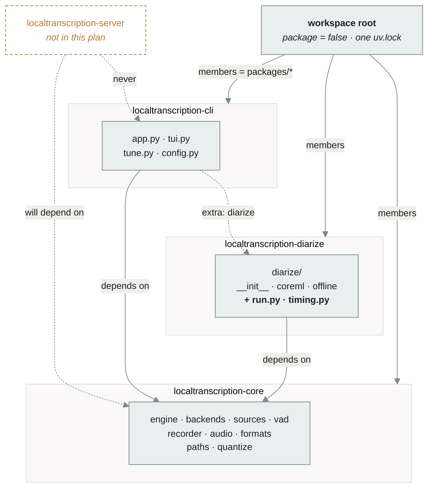
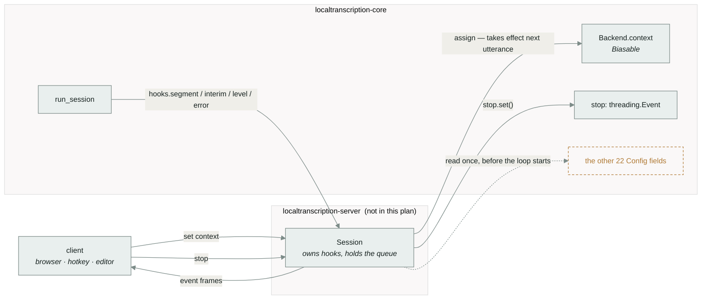

# Split `localtranscription` into a uv workspace

Research this rests on: [`docs/research/2026-08-21-module-boundaries.md`](../research/2026-08-21-module-boundaries.md).
Every uv mechanism named below was executed against uv 0.9.16 before being written down;
§2 of the research doc has the runs.

---

## 1. Product review

### The problem

A websocket front end is coming — one that streams audio and transcript in both
directions and takes messages that change settings mid-session. It cannot be written
against the package as it stands, for a reason that has nothing to do with websockets:

**four contracts that a non-CLI caller needs live inside `app.py`, behind `typer` and
`rich`.** Parameter validation and `Cadence` construction (`app.py:197-267`), the
per-speaker word-timing pass added three commits ago (`app.py:1064-1094`), the
diarization run and its reporting (`app.py:1095-1127`), and the backend-load error
conversion (`app.py:268-297`). A second front end either imports `typer` to get at them
or reimplements them. The TUI already shows what that costs: it is the third anonymous
`Hooks` class in the tree.

The dependency weight is not the problem — `typer` and `textual` are small, and the
heavy things (`torch`, `mlx`, `coremltools`) are already extras. The problem is that
there is no boundary an import can fail to cross, so nothing stops the next contract
from landing in `app.py` too.

### What success looks like

Read after shipping, in this order:

1. A virtualenv with only `localtranscription-core` installed can run a session end to
   end. `import typer` fails in it. This is a test, not a convention —
   research §2.4 shows the namespace does not paper over a missing member.
2. `lt transcribe FILE --speakers` produces its seven output files with the same content
   as at `118ae70`, and the code that times words by speaker block is reachable without
   importing anything that draws to a terminal.
3. `uv tool install -e './packages/localtranscription-cli[mlx,diarize]'` gives a live
   `lt`, with edits to **core** picked up without a reinstall — verified behaviour, not a
   hope (research §2.3).
4. The four checks in README §Checks are still clean and still one command each.

### Scope

This is the "large" shape: product review, architecture, program design and slices, all
below. It earns that because it moves every file in `src/` and rewrites the build,
lint and type configuration. The design space, however, is narrow — the decisions in §2.3
are the whole of it.

---

## 2. System architecture

### 2.1 Three distributions, one import namespace



*All three ship into `localtranscription.*`. The arrows are the enforceable part: an
install that omits a member makes its modules unimportable, which is what turns
"core must not import typer" into a failing test.*

Import paths do not change. `from localtranscription.engine import run_session` resolves
the same before and after, because `localtranscription/` becomes a PEP 420 implicit
namespace shared by all three distributions (research §2.2).

### 2.2 What each member owns

| Distribution | Modules | Runtime dependencies | Extras |
|---|---|---|---|
| `localtranscription-core` | `paths` `vad` `audio` `formats` `recorder` `sources` `backends` `engine` `quantize` | `numpy` `torch` `qwen-asr` `sounddevice` `soundfile` | `mlx` → `mlx-qwen3-asr` |
| `localtranscription-diarize` | `diarize/` | `localtranscription-core` `coremltools` `scipy` | — |
| `localtranscription-cli` | `app` `tui` `tune` `config` | `localtranscription-core` `typer` `rich` `textual` | `mlx` → `core[mlx]`; `diarize` → `localtranscription-diarize` |

Three consequences worth naming:

- **`coremltools` and `scipy` stop being extras and become plain dependencies of
  `localtranscription-diarize`.** Installing that distribution *is* the opt-in. The
  `diarize` extra survives at the CLI level and now gates a whole package rather than
  two libraries, so `lt transcribe --speakers` fails the same way it does today.
- **`rich` gets declared.** It is imported at `app.py:15` and `tui.py:16` and is not in
  `[project.dependencies]` today — it arrives transitively through `typer`. That works
  until it doesn't.
- **`quantize.py` goes to core, not the CLI.** It is `lt quantize`'s implementation, but
  it shares the `mlx` extra with `backends.py`, and putting it in core lets that extra be
  declared once.

### 2.3 Decisions, with what was rejected

| # | Decision | Rejected alternative | Why |
|---|---|---|---|
| D1 | Keep the `localtranscription.*` import namespace, split via PEP 420 | Rename roots to `lt_core.*`, `lt_cli.*` | ~200 import edits across `src/` and `tests/`, every README code block, and any script anyone has written. The split is meant to add a package, not rename the project. Cost of D1: the top-level `__init__.py` must be deleted from every member, and a stale one left anywhere silently breaks the others. |
| D2 | Three members now; `localtranscription-server` later | Create the server package empty in this plan | An empty package is a claim about a design that has not been made. §5 shows the seam it will attach to; that is enough to check the boundary is in the right place. |
| D3 | Directory names match distribution names (`packages/localtranscription-core/`) | Short names (`packages/core/`) | `uv sync` prints distribution names. When the two diverge, output stops matching the tree. Costs a longer `uv tool install` path, once. |
| D4 | One `tests/` at the repo root | Per-package `tests/`, run with `uv run --package X pytest` | The suite is 2,050 lines, offline, and cross-cutting — `test_core.py` alone touches `config`, `backends`, `formats`, `recorder`, `vad`, `paths` and `tune`. The root venv holds every member, so the suite runs unchanged. |
| D5 | `config.py` stays whole, in the CLI | Split its file-reading half into core | `default_map`, `EXCLUDED`, `reaches` and `template` are all Click-shaped. The server will be launched *by* the CLI (`lt serve`), so it receives a built `Config` rather than reading the file itself. Revisit if that stops being true. |
| D6 | Lint and type configuration stays in the root `pyproject.toml` | Per-member tool config | Verified: `ty` reports a cross-package type error with both files named, and `ruff` honours `"**/app.py"` per-file-ignores from the root. One config, four commands, unchanged. |

### 2.4 Configuration that has to move

- `[tool.hatch.build.targets.wheel] packages = ["src/localtranscription"]` — repeated
  verbatim in each member's own `pyproject.toml`.
- `[tool.ruff] src` — from `["src", "tests"]` to the three member `src` directories plus
  `tests`.
- `[tool.ruff.lint.per-file-ignores]` — four literal paths become globs (`"**/app.py"`,
  `"**/engine.py"`, `"**/sources.py"`, `"**/tui.py"`), so they survive slices 2 and 3
  without a second edit.
- `[tool.ty.src] include` and `[tool.ty.environment] root` — the three member `src`
  directories.
- `[project.scripts]` (`localtranscription`, `lt`) — to `localtranscription-cli`.
- `__version__ = "0.3.0"` at `src/localtranscription/__init__.py:3` — deleted with the
  file. Nothing reads it (research §1.6). Each member carries its own `version` in
  `pyproject.toml`, all starting at `0.4.0`. If `lt --version` is ever wanted:
  `importlib.metadata.version("localtranscription-cli")`.

---

## 3. Program design

### 3.1 File tree, before → after

```diff
  localtranscription/
- src/localtranscription/
-   __init__.py                       # __version__, read by nothing
-   paths.py  vad.py  audio.py  formats.py  recorder.py
-   sources.py  backends.py  engine.py  quantize.py
-   config.py  tune.py  tui.py  app.py
-   diarize/{__init__,coreml,offline}.py
+ packages/
+   localtranscription-core/
+     pyproject.toml
+     src/localtranscription/         # PEP 420 -- no __init__.py here
+       paths.py  vad.py  audio.py  formats.py  recorder.py
+       sources.py  backends.py  engine.py  quantize.py
+   localtranscription-diarize/
+     pyproject.toml
+     src/localtranscription/         # PEP 420 -- no __init__.py here
+       diarize/
+         __init__.py                 # keeps its own; it has 159 lines of content
+         coreml.py  offline.py
+         run.py                      # NEW  <- app.py:1095-1127
+         timing.py                   # NEW  <- app.py:1064-1094
+   localtranscription-cli/
+     pyproject.toml
+     src/localtranscription/         # PEP 420 -- no __init__.py here
+       app.py  tui.py  tune.py  config.py
  tests/                              # unchanged, still at the root
  pocs/                               # unchanged, frozen PEP 723 scripts
  docs/
+ pyproject.toml                      # workspace root: package = false
  uv.lock                             # one lockfile, whole workspace
```

### 3.2 The three signatures that change

Each replaces a `typer`/`rich` coupling with a callback. No behaviour changes; the CLI
supplies callbacks that do exactly what the inline `console` calls did.

```python
# localtranscription/engine.py        (core)      <- app.py:197-267

class InvalidConfig(ValueError):
    """A session parameter that cannot be honoured. Message is user-facing."""

def build_config(
    *, out, language, device, mic, wav, threshold,
    first, growth, max_gap, record, record_dir,
    backend, model, aligner, dtype, partials, stream_chunk,
    min_speech=MIN_SPEECH_SEC, context="",
) -> Config: ...
    # Same six checks, same messages, raising InvalidConfig instead of
    # typer.BadParameter. Keyword-only for the reason app.py:222 already gives.
    # Still the only place that says --interim 0 means cadence=None.
```

```python
# localtranscription/diarize/timing.py    (diarize)    <- app.py:1064-1094

def align_by_speaker(
    backend: Aligning,
    audio: np.ndarray,
    segments, turns, *,
    language: str,
    on_block=None,   # (done: int, total: int) -> None      was console.status
    on_error=None,   # (start: float, exc: Exception) -> None  was console.print
) -> list[dict]: ...
```

Lives in `diarize`, not core, because it needs `diarize.speaker_blocks`. That is the
right home anyway: it is the speaker half of `lt transcribe --speakers`.

```python
# localtranscription/diarize/run.py       (diarize)    <- app.py:1095-1127

def diarize_audio(
    audio: np.ndarray, *, num_speakers: int | None = None, on_status=None
) -> list[Turn]: ...
    # Raises DiarizationUnavailable / ValueError. The "needs a file, not a live
    # source" check stays in the CLI -- it is about the flags, not the audio.

def speaker_holds(turns, duration: float) -> list[tuple[int, float, float]]: ...
    # (speaker, seconds held, fraction of duration) -- so the CLI prints rather
    # than computes the table at app.py:1121-1127.
```

### 3.3 Call stack for `lt transcribe --speakers`, before → after

```diff
  app.transcribe()
- ├── app._config()                          raises typer.BadParameter
+ ├── app._config()                          catches InvalidConfig -> BadParameter
+ │   └── engine.build_config()              core; no typer
- ├── app._diarize_audio(audio, n)           console.status x2, console.print xN
- │   └── diarize.offline.OfflineDiarizer.diarize()
+ ├── app._diarize(audio, n)                 console.status + console.print only
+ │   ├── diarize.run.diarize_audio(on_status=...)
+ │   │   └── diarize.offline.OfflineDiarizer.diarize()
+ │   └── diarize.run.speaker_holds()        the numbers app.py used to compute inline
  ├── engine.run_session(cfg, Hooks())
- ├── app._align_blocks(backend, ...)        console.status, console.print
- │   ├── diarize.speaker_blocks()
- │   └── backend.align()                    x blocks
+ ├── app._time_words(...)                   console.status + console.print only
+ │   └── diarize.timing.align_by_speaker(on_block=..., on_error=...)
+ │       ├── diarize.speaker_blocks()
+ │       └── backend.align()                x blocks
  └── app._report()                          write_outputs + console.print
```

Every `-` line is a function that cannot be called without importing `typer`. Every `+`
line under it can.

---

## 4. Vertical slices

Four slices. Each one ends with the tree green and `lt` working — no slice leaves the
repo in a state where the next one is required. Each carries two checklists, and **the
manual column is not tickable by an agent.**

The automated checks are the same four everywhere, so they are written once:

```sh
uv sync --extra mlx --extra diarize
uv run ruff check . && uv run ruff format --check .
uv run ty check
uv run pytest tests/ -q
```

### Slice 1 — the workspace exists, nothing else changes

`git mv src/ packages/localtranscription/src/`. Root `pyproject.toml` becomes virtual
(`[tool.uv] package = false`, `[tool.uv.workspace] members = ["packages/*"]`,
`[tool.uv.sources]`), keeping `[tool.ruff]`, `[tool.ty.*]` and `[dependency-groups]`.
The member keeps the current `[project]` block verbatim, name and all. **No Python file
is edited.**

This is the tracer bullet: it proves hatchling, ruff paths, ty roots, pytest collection,
the lockfile and `uv tool install` all survive the move, before a single module boundary
is drawn.

**Automated** — the four above, plus:
- [ ] `uv run lt --help`, `uv run lt paths`, `uv run lt backends` exit 0
- [ ] `uv.lock` regenerates and resolves the same versions (`git diff uv.lock` shows only
      the source-path change)

**Manual**
- [ ] `uv tool install -e './packages/localtranscription[mlx,diarize]' --force`, then `lt`
      from an unrelated directory
- [ ] `lt tui` against the mic: partials render, `k` opens the context field, editing it
      changes the next utterance
- [ ] `lt dictate | pbcopy` round-trips

### Slice 2 — cut `diarize` out

The easiest seam: `diarize/` has no internal imports (research §1.1). This is where the
PEP 420 change lands, on the boundary with the least to go wrong.

- New member `packages/localtranscription-diarize/`, `git mv` of `diarize/`.
- Delete `src/localtranscription/__init__.py` from **both** members. This is D1's cost,
  paid here.
- The remaining member is renamed `localtranscription-cli` and grows
  `diarize = ["localtranscription-diarize"]` as an extra; `coremltools` and `scipy` move
  to the new member's plain dependencies.

**Automated**
- [ ] `uv run pytest tests/test_diarize.py -q` passes unchanged
- [ ] `uv pip install --python <scratch venv> -e ./packages/localtranscription-diarize`,
      then `import localtranscription.diarize` succeeds and `import localtranscription.app`
      raises `ModuleNotFoundError`
- [ ] `python -c "import localtranscription"` does **not** find a stray `__init__.py`
      (`localtranscription.__file__ is None`)

**Manual**
- [ ] `lt diarize tests/fixtures/interview-excerpt.flac` prints the same speakers and
      hold times as at `118ae70`
- [ ] `lt transcribe tests/fixtures/interview-excerpt.flac --speakers` still writes all
      seven files

### Slice 3 — cut the runtime out of the CLI

The nine core modules move to `packages/localtranscription-core/`. `app.py`, `tui.py`,
`tune.py` and `config.py` stay. No Python edits beyond what `ruff check` demands.

**Automated**
- [ ] **The gate.** In a scratch venv with only `localtranscription-core` installed:
      `import localtranscription.engine` succeeds; `import typer`, `import textual`,
      `import localtranscription.app` and `import localtranscription.diarize` all raise.
- [ ] A session runs headlessly in that venv: `run_session` over a WAV source with a fake
      `Backend`, asserting segments come out. Added as `tests/test_workspace_gate.py`, and
      skipped when the scratch venv is absent so the suite stays offline.
- [ ] `uv run ty check` still resolves cross-package references (verified working in
      research §2 with the multi-root config)

**Manual**
- [ ] All three front ends against the mic: `lt tui`, `lt cli`, `lt dictate --hold`
- [ ] `lt tune` completes and `--write` produces a config the new `lt` accepts
- [ ] `--backend mlx` after `uv sync --extra mlx`
- [ ] `lt quantize` builds a checkpoint and `lt models` lists it

### Slice 4 — move the four contracts out of `app.py`

The three signatures in §3.2, and the call stack in §3.3. `app.py` keeps thin wrappers
that catch and print. This is the slice that makes the boundary worth having; it is also
the only one that edits Python, so it is last and separable.

**Automated**
- [ ] `engine.build_config` rejects each of the six bad inputs `app._config` rejects,
      with the same message text, raising `InvalidConfig`
- [ ] `diarize.timing.align_by_speaker` reproduces the word list `_align_blocks` produced
      for `tests/fixtures/interview-excerpt.flac` — compared against the committed
      `interview-excerpt.json`, so this checks correctness, not just no-change
- [ ] `on_error` fires and the pass continues when one block's `align()` raises
- [ ] `grep -rn "typer\.\|console\." packages/localtranscription-core/src packages/localtranscription-diarize/src` returns nothing

**Manual**
- [ ] `lt transcribe FILE --speakers` output is byte-identical to `118ae70`'s for the
      fixture, including the per-speaker table and the "N words timed across M speaker
      blocks" line
- [ ] A block that fails to align still prints its yellow warning and the transcript
      survives
- [ ] Every `typer.BadParameter` message a user could hit reads the same as before

### Documentation, at the end of each slice

README §Layout, §Install and §Checks are wrong the moment slice 1 lands. Each slice
updates them as part of the slice, not afterwards.

---

## 5. Why these seams, and not others

This section is here to check the boundary, not to design the server. The server is
[not in this plan](#what-were-not-doing).

Research §1.4 turned up something that decides the shape of any runtime-settings
protocol: **exactly two things in a session are mutable today.**



`Backend.context` is already designed for this — `backends.py:145-160` says the attribute
exists rather than a `transcribe()` argument precisely so a front end can change it while
the session runs, and `tui.py:259` does. `stop` is handed out through `hooks.bind_stop`.
Everything else — `threshold`, `cadence`, `min_speech`, `partials`, `language`, `model` —
is read once, before or at the top of `run_session`'s loop.

So a protocol message like `settings.set {language: "Greek"}` has no landing site today.
It would mean either restarting the session or making `run_session`'s loop re-read its
config each utterance. **That is a design question about the engine, not about
websockets**, and it is the reason the server is a separate plan rather than a slice
here. This plan's job is to make sure that when the question is answered, the answer can
be written in `localtranscription-core` and consumed by a package that has never heard of
`typer`.

The gate in slice 3 is what proves it.

---

## What we're NOT doing

- **No websocket server, no message protocol, no `localtranscription-server` package.**
  §5 checks the seam; it does not build on it.
- **No new runtime-mutable settings.** `Backend.context` and `stop` stay the only two.
  Making `language` or `cadence` changeable mid-session is engine work with its own plan.
- **No import-root rename.** `localtranscription.*` throughout (D1).
- **No splitting of `backends.py`.** The `Backend` protocol and its two implementations
  stay in one module and one distribution. Separating them needs a plugin registry to
  replace `BACKENDS = {"torch": ..., "mlx": ...}`, and nothing has asked for a third
  backend.
- **No `config.py` split** (D5).
- **No behaviour changes.** Slice 4 moves code and swaps `console` calls for callbacks.
  If a message string changes, that is a bug in the slice.
- **No CI.** There is none today; adding one is not this plan.
- **`pocs/` is not touched.** Frozen PEP 723 scripts, and `pocs/live2.py` still runs on
  its own.

---

## Open questions for review

1. **Slice 4 in or out?** Slices 1–3 are "refactor into a workspace". Slice 4 is "and
   make the boundary mean something". Cutting it leaves a workspace whose core cannot
   time words by speaker — which is most of what a server would want.
2. **`localtranscription-core` is a poor name for something that carries `torch` and
   `sounddevice`.** `-runtime`? `-engine`? Cheap to change now, annoying later.
3. **D3 (long directory names).** `uv tool install -e './packages/localtranscription-cli[mlx,diarize]'`
   is the line that goes in the README. Acceptable?

---

## Risks

| Risk | Signal it happened | Response |
|---|---|---|
| A stray `__init__.py` survives in one member | `localtranscription.__file__` is not `None`; another member's modules stop importing | Slice 2's third automated check catches it |
| `uv tool install` from a member does not pick up sibling edits | `lt` runs stale core code after an edit | Verified working (research §2.3); if it regresses, `uv tool install -e` each member |
| One lockfile cannot satisfy `torch` + `mlx` + `coremltools` together | `uv lock` fails or downgrades something | Already the case today — one distribution, both extras. The workspace does not change the resolution, only where the requirements are written |
| `ty` loses cross-package resolution | `ty check` reports unresolved imports between members | Verified working with the multi-root config; fallback is to drop `[tool.ty.environment] root` and resolve through the synced `.venv` |
| Slice 4 changes a user-visible message | Manual check on `lt transcribe --speakers` output | The comparison is against `118ae70` output, captured before slice 1 starts |
