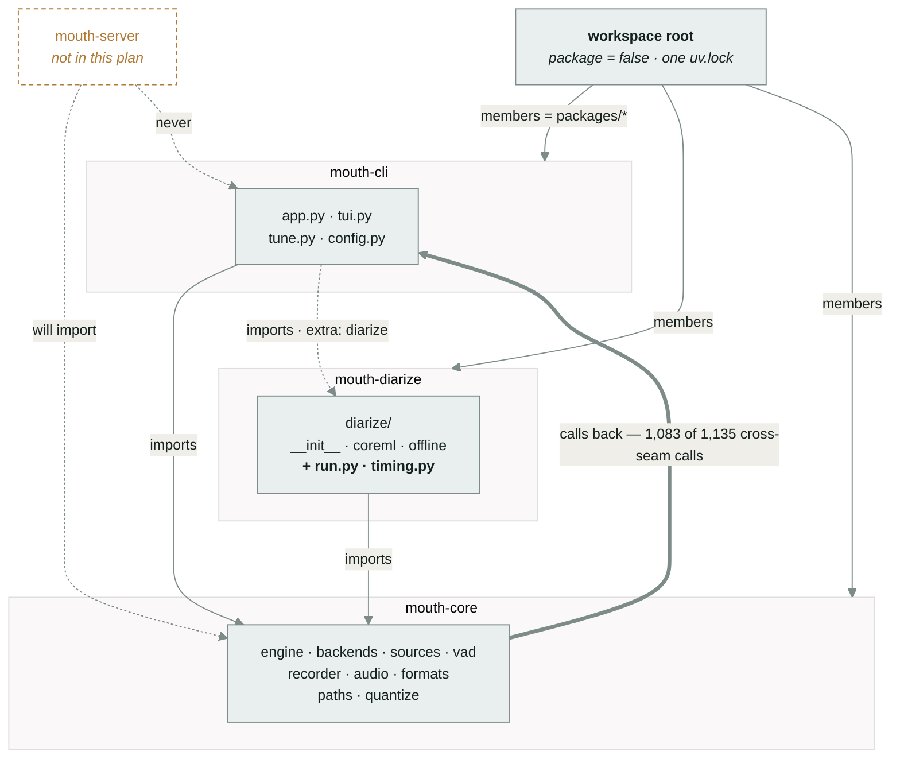
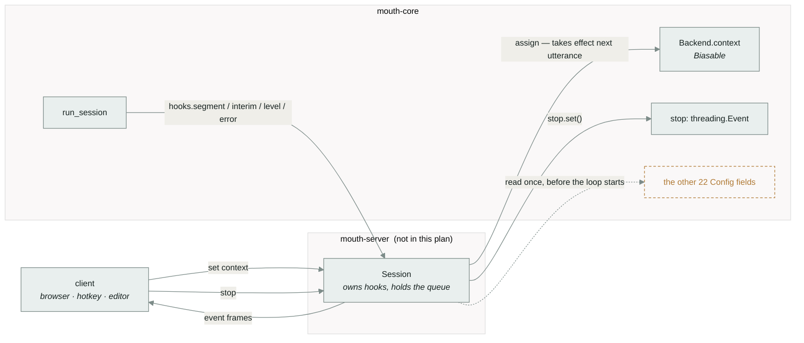

# Split `mouth` into a uv workspace

Research this rests on: [`docs/research/2026-08-21-module-boundaries.md`](../research/2026-08-21-module-boundaries.md).
Every uv mechanism named below was executed against uv 0.9.16 before being written down;
§2 of the research doc has the runs, and §1.3 has the call graph.

> **Revision, 2026-08-21.** The first version of this plan was written from an import
> graph. Extracting the actual call graph — statically, then by tracing a real
> `m transcribe --speakers` — changed three things in it: `formats.py` turned out to
> call into `diarize` (D7 below), the heaviest boundary traffic runs *from* core *into*
> the CLI rather than the reverse (§3.4), and the interface carrying that traffic is a
> docstring rather than a type (D8). Slices 1–3 are unchanged.

---

## 1. Product review

### The problem

A websocket front end is coming — one that streams audio and transcript in both
directions and takes messages that change settings mid-session. Three things stop it
being written against the package as it stands, and none of them is about websockets.

**The interface it would implement is a docstring.** `run_session` drives the entire
session by calling back into a `hooks` object: six methods, specified in prose at
`engine.py:322-330`, implemented three times as anonymous classes inside typer commands.
A traced `m transcribe --speakers` puts **1,083 of 1,135 cross-package calls** through
it (research §1.3) — more than every other cross-module edge in the program combined.
Nothing type-checks it, and a fourth implementation is the entire point of this refactor.

**Four contracts it needs are welded to `typer` and `rich`.** Parameter validation and
the `Cadence` rule (`app.py:197-267`), the per-speaker word-timing pass from `9d8fbf5`
(`app.py:1064-1094`), the diarization run and its reporting (`app.py:1095-1127`), and the
backend-load error conversion (`app.py:268-297`). A second front end either imports
`typer` to reach them or reimplements them.

**And one module already sits on the wrong side.** `formats.py` belongs in core and
imports `diarize` from inside two function bodies — invisible in the import graph,
exercised on the primary command path (§D7).

The dependency weight is not the problem: `typer` and `textual` are small, and the heavy
things (`torch`, `mlx`, `coremltools`) are already extras. The problem is that **there is
no boundary an import can fail to cross**, so nothing stops the next contract from
landing in `app.py` too — and nothing caught the one that already went the other way.

### What success looks like

Read after shipping, in this order:

1. A virtualenv with only `mouth-core` installed can run a session end to
   end. `import typer` fails in it. This is a test, not a convention —
   research §2.4 shows the namespace does not paper over a missing member.
2. `m transcribe FILE --speakers` produces its seven output files with the same content
   as at `118ae70`, and the code that times words by speaker block is reachable without
   importing anything that draws to a terminal.
3. `uv tool install -e './packages/mouth-cli[mlx,diarize]'` gives a live
   `m`, with edits to **core** picked up without a reinstall — verified behaviour, not a
   hope (research §2.3).
4. The four checks in README §Checks are still clean and still one command each. (One
   of them was not, at the base commit — see §4.)
5. Re-running the call-graph extraction after slice 4 shows **zero `core → diarize`
   import edges** and the same `core → cli` call edges as today, now going through a
   declared protocol instead of a docstring.

### Scope

This is the "large" shape: product review, architecture, program design and slices, all
below. It earns that because it moves every file in `src/` and rewrites the build, lint
and type configuration. The design space is still narrow — the eight decisions in §2.3
are the whole of it — but note that two of them, D7 and D8, exist only because the call
graph was extracted. They were invisible to the reading that produced D1–D6.

---

## 2. System architecture

### 2.1 Three distributions, one import namespace



*All three ship into `mouth.*`. Thin arrows are imports and are the
enforceable part: an install that omits a member makes its modules unimportable, which is
what turns "core must not import typer" into a failing test. **The thick arrow is calls,
and it points the other way** — measured, not assumed (research §1.3). Core never imports
the CLI; it calls back through callables the front end handed it. That is why a websocket
server can be a peer of `app.py` rather than a layer under it.*

Import paths do not change. `from mouth.engine import run_session` resolves
the same before and after, because `mouth/` becomes a PEP 420 implicit
namespace shared by all three distributions (research §2.2).

### 2.2 What each member owns

| Distribution | Modules | Runtime dependencies | Extras |
|---|---|---|---|
| `mouth-core` | `paths` `vad` `audio` `formats` `recorder` `sources` `backends` `engine` `quantize` | `numpy` `torch` `qwen-asr` `sounddevice` `soundfile` | `mlx` → `mlx-qwen3-asr` |
| `mouth-diarize` | `diarize/` | `mouth-core` `coremltools` `scipy` | — |
| `mouth-cli` | `app` `tui` `tune` `config` | `mouth-core` `typer` `rich` `textual` | `mlx` → `core[mlx]`; `diarize` → `mouth-diarize` |

Three consequences worth naming:

- **`coremltools` and `scipy` stop being extras and become plain dependencies of
  `mouth-diarize`.** Installing that distribution *is* the opt-in. The
  `diarize` extra survives at the CLI level and now gates a whole package rather than
  two libraries, so `m transcribe --speakers` fails the same way it does today.
- **`rich` gets declared.** It is imported at `app.py:15` and `tui.py:16` and is not in
  `[project.dependencies]` today — it arrives transitively through `typer`. That works
  until it doesn't.
- **`quantize.py` goes to core, not the CLI.** It is `m quantize`'s implementation, but
  it shares the `mlx` extra with `backends.py`, and putting it in core lets that extra be
  declared once.

### 2.3 Decisions, with what was rejected

| # | Decision | Rejected alternative | Why |
|---|---|---|---|
| D1 | Keep the `mouth.*` import namespace, split via PEP 420 | Rename roots to `lt_core.*`, `lt_cli.*` | ~200 import edits across `src/` and `tests/`, every README code block, and any script anyone has written. The split is meant to add a package, not rename the project. Cost of D1: the top-level `__init__.py` must be deleted from every member, and a stale one left anywhere silently breaks the others. |
| D2 | Three members now; `mouth-server` later | Create the server package empty in this plan | An empty package is a claim about a design that has not been made. §5 shows the seam it will attach to; that is enough to check the boundary is in the right place. |
| D3 | Directory names match distribution names (`packages/mouth-core/`) | Short names (`packages/core/`) | `uv sync` prints distribution names. When the two diverge, output stops matching the tree. Costs a longer `uv tool install` path, once. |
| D4 | One `tests/` at the repo root | Per-package `tests/`, run with `uv run --package X pytest` | The suite is 2,050 lines, offline, and cross-cutting — `test_core.py` alone touches `config`, `backends`, `formats`, `recorder`, `vad`, `paths` and `tune`. The root venv holds every member, so the suite runs unchanged. |
| D5 | `config.py` stays whole, in the CLI | Split its file-reading half into core | `default_map`, `EXCLUDED`, `reaches` and `template` are all Click-shaped. The server will be launched *by* the CLI (`m serve`), so it receives a built `Config` rather than reading the file itself. Revisit if that stops being true. |
| D6 | Lint and type configuration stays in the root `pyproject.toml` | Per-member tool config | Verified: `ty` reports a cross-package type error with both files named, and `ruff` honours `"**/app.py"` per-file-ignores from the root. One config, four commands, unchanged. |
| D7 | `formats.write_outputs` and `speaker_md` take **already-labelled** words; the `from .diarize import label_words` at `formats.py:88,164` goes away | Move `Turn` and `label_words` into core; or put `formats.py` in the diarize package | This is the only `core → diarize` import in the tree and the call graph shows the primary command path hits it (research §1.3). It is also nearly dead already: in the traced run `write_outputs`' own call site did **not** fire, because `_align_blocks` had labelled every word — which the comment at `formats.py:168` says it relies on. Making pre-labelling the contract deletes the fallback rather than relocating it. `formats` keeps reading `Turn.start/.end/.speaker/.duration` duck-typed, which needs no import and is fine. |
| D8 | Declare the `hooks` contract as `engine.SessionHooks`, a `typing.Protocol` | Leave it as the docstring at `engine.py:322-330` | It carries 1,083 of 1,135 cross-seam calls and has three implementations, none of which any checker can verify against it. A fourth is the entire point of this refactor. Same shape as `Backend`, `Biasable` and `Aligning`, which the codebase already expresses this way and which `56002b1` chose deliberately over flags. |

### 2.4 Configuration that has to move

- `[tool.hatch.build.targets.wheel] packages = ["src/mouth"]` — repeated
  verbatim in each member's own `pyproject.toml`.
- `[tool.ruff] src` — from `["src", "tests"]` to the three member `src` directories plus
  `tests`.
- `[tool.ruff.lint.per-file-ignores]` — four literal paths become globs (`"**/app.py"`,
  `"**/engine.py"`, `"**/sources.py"`, `"**/tui.py"`), so they survive slices 2 and 3
  without a second edit.
- `[tool.ty.src] include` and `[tool.ty.environment] root` — the three member `src`
  directories.
- `[project.scripts]` (`m`) — to `mouth-cli`.
- `__version__ = "0.3.0"` at `src/mouth/__init__.py:3` — deleted with the
  file. Nothing reads it (research §1.6). Each member carries its own `version` in
  `pyproject.toml`, all starting at `0.4.0`. If `m --version` is ever wanted:
  `importlib.metadata.version("mouth-cli")`.

---

## 3. Program design

### 3.1 File tree, before → after

```diff
  mouth/
- src/mouth/
-   __init__.py                       # __version__, read by nothing
-   paths.py  vad.py  audio.py  formats.py  recorder.py
-   sources.py  backends.py  engine.py  quantize.py
-   config.py  tune.py  tui.py  app.py
-   diarize/{__init__,coreml,offline}.py
+ packages/
+   mouth-core/
+     pyproject.toml
+     src/mouth/         # PEP 420 -- no __init__.py here
+       paths.py  vad.py  audio.py  formats.py  recorder.py
+       sources.py  backends.py  engine.py  quantize.py
+   mouth-diarize/
+     pyproject.toml
+     src/mouth/         # PEP 420 -- no __init__.py here
+       diarize/
+         __init__.py                 # keeps its own; it has 159 lines of content
+         coreml.py  offline.py
+         run.py                      # NEW  <- app.py:1095-1127
+         timing.py                   # NEW  <- app.py:1064-1094
+   mouth-cli/
+     pyproject.toml
+     src/mouth/         # PEP 420 -- no __init__.py here
+       app.py  tui.py  tune.py  config.py
  tests/                              # unchanged, still at the root
  pocs/                               # unchanged, frozen PEP 723 scripts
  docs/
+ pyproject.toml                      # workspace root: package = false
  uv.lock                             # one lockfile, whole workspace
```

### 3.2 The five signatures that change

The first three replace a `typer`/`rich` coupling with a callback; the last two are D8
and D7. No behaviour changes: the CLI supplies callbacks that do exactly what the inline
`console` calls did, `SessionHooks` is a type over calls that already happen, and D7
deletes a fallback the traced run showed does not fire.

```python
# mouth/engine.py        (core)      <- app.py:197-267

class InvalidConfig(ValueError):
    """A session parameter that cannot be honoured. Message is user-facing."""

def build_config(
    *, out, language, device, mic, wav, threshold,
    first, growth, max_gap, record, record_dir,
    backend, model, aligner, dtype, partials, stream_chunk,
    min_speech=MIN_SPEECH_SEC, context="",
) -> Config: ...
    # Same six checks, same messages, raising InvalidConfig instead of
    # typer.BadParameter. Keyword-only for the reason app.py:222 already gives.
    # Still the only place that says --interim 0 means cadence=None.
```

```python
# mouth/diarize/timing.py    (diarize)    <- app.py:1064-1094

def align_by_speaker(
    backend: Aligning,
    audio: np.ndarray,
    segments, turns, *,
    language: str,
    on_block=None,   # (done: int, total: int) -> None      was console.status
    on_error=None,   # (start: float, exc: Exception) -> None  was console.print
) -> list[dict]: ...
```

Lives in `diarize`, not core, because it needs `diarize.speaker_blocks`. That is the
right home anyway: it is the speaker half of `m transcribe --speakers`.

```python
# mouth/diarize/run.py       (diarize)    <- app.py:1095-1127

def diarize_audio(
    audio: np.ndarray, *, num_speakers: int | None = None, on_status=None
) -> list[Turn]: ...
    # Raises DiarizationUnavailable / ValueError. The "needs a file, not a live
    # source" check stays in the CLI -- it is about the flags, not the audio.

def speaker_holds(turns, duration: float) -> list[tuple[int, float, float]]: ...
    # (speaker, seconds held, fraction of duration) -- so the CLI prints rather
    # than computes the table at app.py:1121-1127.
```

```python
# mouth/engine.py        (core)      <- D8, the docstring at engine.py:322

@runtime_checkable
class SessionHooks(Protocol):
    """What run_session calls back into. The front end supplies this.

    Carries 1,083 of the 1,135 cross-package calls in a traced `m transcribe
    --speakers` run -- the busiest interface in the program, and until now the only
    one described in prose rather than in types.
    """

    def status(self, msg: str) -> None: ...
    def ready(self, threshold: float) -> None: ...
    def bind_stop(self, stop: threading.Event) -> None: ...
    def level(self, rms: float, in_speech: bool) -> None: ...      # ~33/second
    def segment(self, seg: Segment) -> None: ...
    def error(self, offset: float, msg: str) -> None: ...

# Optional halves stay optional and stay probed with getattr, as they are today:
# interim(Segment), attach(worker, recorder), source(source). Putting them on the
# Protocol would make every front end that skips one fail the isinstance check --
# the same argument backends.py:186-190 already makes for Streaming and Drafting.
```

```python
# mouth/formats.py       (core)      <- D7

def write_outputs(
    out_dir: Path, segments, words, stem=None, turns=None
) -> Path | None: ...
    # `words` carry their own "speaker" when turns are given. The lazy
    # `from .diarize import label_words` at :88 and :164 goes; the caller labels.
    # In the traced run the :164 site never fired, because _align_blocks had
    # already labelled every word -- which is what the comment at :168 relies on.
```

### 3.3 Call stack for `m transcribe --speakers`, before → after

Not sketched — traced. `sys.setprofile` over a real run against the fixture, mlx backend,
all seven outputs written; `x N` is the measured call count.

```diff
  app.transcribe()                                                 [cli]
- ├── app._config()                          raises typer.BadParameter
+ ├── app._config()                          catches InvalidConfig -> BadParameter
+ │   └── engine.build_config()              core; no typer
- ├── app._diarize_audio(audio, n)           console.status x2, console.print xN
- │   ├── diarize.offline.OfflineDiarizer.__init__()    x1
- │   │   └── app._diarize_audio.<lambda>    x2   <-- core calling back into cli
- │   ├── diarize.offline.OfflineDiarizer.diarize()     x1
- │   └── <genexpr> -> diarize.Turn.duration            x13
+ ├── app._diarize(audio, n)                 console.status + console.print only
+ │   ├── diarize.run.diarize_audio(on_status=...)      x1
+ │   │   └── diarize.offline.OfflineDiarizer.diarize() x1
+ │   └── diarize.run.speaker_holds()        the x13 Turn.duration tally, moved
  ├── app._load() -> backends.load_backend()             x1
  │   └── backends.MlxBackend.__init__() -> _load.<lambda>   x2
  ├── engine.run_session(cfg, Hooks())                   x1
  │   ├── vad.segment_utterances()                       x11
- │   │   └── app.transcribe.Hooks.level()   x1066   <-- 94% of all seam traffic
+ │   │   └── SessionHooks.level()           x1066   same call, now a declared type
  │   ├── engine.Transcriber._transcribe_one() -> Hooks.segment()   x10
  │   └── run_session -> Hooks.{status, source, ready, bind_stop}   x1 each
- ├── app._align_blocks(backend, ...)        console.status, console.print
- │   ├── diarize.speaker_blocks()                      x1
- │   └── backends.MlxBackend.align()                   x9
+ ├── app._time_words(...)                   console.status + console.print only
+ │   └── diarize.timing.align_by_speaker(on_block=..., on_error=...)
+ │       ├── diarize.speaker_blocks()                  x1
+ │       └── backend.align()                           x9
  └── app._report() -> formats.write_outputs()          x1
      ├── formats.rttm() -> diarize.Turn.duration       x13   (duck-typed, stays)
-     └── formats.speaker_md() -> diarize.label_words() x1    <-- core -> diarize IMPORT
+     └── formats.speaker_md(labelled_words)            x0    D7: the import goes
```

Every `-` line marked `<--` is a coupling the import graph did not show.

### 3.4 The direction of the seam

The measured cross-package traffic, by direction:

| Direction | Runtime edges | Runtime calls | Share |
|---|---:|---:|---:|
| `core → cli` (callbacks) | 8 | 1,083 | 95.4% |
| `cli → core` | 11 | 19 | 1.7% |
| `cli → diarize` | 5 | 17 | 1.5% |
| `core → diarize` | 2 | 14 | 1.2% |
| `diarize → cli` (callback) | 1 | 2 | 0.2% |

Three consequences for this plan:

1. **The boundary is already a callback interface**, not a layered API. `cli → core` is
   19 calls in a whole session — it is setup. The traffic is core calling out. That is
   the shape a server wants, and it means the server is a **peer** of `app.py`, not a
   layer beneath it. D8 makes that interface checkable.
2. **`vad.segment_utterances → hooks.level` is 1,066 calls, one per 30ms frame.** It is
   the only hot path across the seam. Nothing in this plan may put work on it — no
   marshalling, no queue, no per-frame allocation. A websocket server must decimate or
   batch on its own side of that callback.
3. **`core → diarize` is the only wrong-direction *import*.** 14 calls, two edges, and
   D7 removes both.

## 4. Vertical slices

Four slices. Each one ends with the tree green and `m` working — no slice leaves the
repo in a state where the next one is required. Each carries two checklists, and **the
manual column is not tickable by an agent.**

The automated checks are the same four everywhere, so they are written once:

```sh
uv sync --extra mlx --extra diarize
uv run ruff check . && uv run ruff format --check .
uv run ty check
uv run pytest tests/ -q
```

All four are green at the base commit. `ruff format --check` was **not**, until it was
fixed on its own just before slice 1 — it had been failing since `9d8fbf5` on one
97-character line. A slice that fails a check it did not break teaches nothing, so the
baseline is restored first and separately.

Slices 3 and 4 add a fifth, which is the point of the exercise:

```sh
uv run python tools/callgraph.py packages/*/src/mouth   # import-level seam
uv run python tools/trace_calls.py -- transcribe FILE --speakers     # call-level seam
```

### Slice 1 — the workspace exists, nothing else changes

`git mv src/ packages/mouth/src/`. Root `pyproject.toml` becomes virtual
(`[tool.uv] package = false`, `[tool.uv.workspace] members = ["packages/*"]`,
`[tool.uv.sources]`), keeping `[tool.ruff]`, `[tool.ty.*]` and `[dependency-groups]`.
The member keeps the current `[project]` block verbatim, name and all. **No Python file
is edited.**

This is the tracer bullet: it proves hatchling, ruff paths, ty roots, pytest collection,
the lockfile and `uv tool install` all survive the move, before a single module boundary
is drawn.

**Automated** — the four above, plus:
- [ ] `uv run m --help`, `uv run m paths`, `uv run m backends` exit 0
- [ ] `uv.lock` regenerates and resolves the same versions (`git diff uv.lock` shows only
      the source-path change)

**Manual**
- [ ] `uv tool install -e './packages/mouth[mlx,diarize]' --force`, then `m`
      from an unrelated directory
- [ ] `m tui` against the mic: partials render, `k` opens the context field, editing it
      changes the next utterance
- [ ] `m dictate | pbcopy` round-trips

### Slice 2 — cut `diarize` out

The easiest seam: `diarize/` has no internal imports (research §1.1). This is where the
PEP 420 change lands, on the boundary with the least to go wrong.

- New member `packages/mouth-diarize/`, `git mv` of `diarize/`.
- Delete `src/mouth/__init__.py` from **both** members. This is D1's cost,
  paid here.
- The remaining member is renamed `mouth-cli` and grows
  `diarize = ["mouth-diarize"]` as an extra; `coremltools` and `scipy` move
  to the new member's plain dependencies.

**Automated**
- [ ] `uv run pytest tests/test_diarize.py -q` passes unchanged
- [ ] `uv pip install --python <scratch venv> -e ./packages/mouth-diarize`,
      then `import mouth.diarize` succeeds and `import mouth.app`
      raises `ModuleNotFoundError`
- [ ] `python -c "import mouth"` does **not** find a stray `__init__.py`
      (`mouth.__file__ is None`)

**Manual**
- [ ] `m diarize tests/fixtures/interview-excerpt.flac` prints the same speakers and
      hold times as at `118ae70`
- [ ] `m transcribe tests/fixtures/interview-excerpt.flac --speakers` still writes all
      seven files

### Slice 3 — cut the runtime out of the CLI

The nine core modules move to `packages/mouth-core/`. `app.py`, `tui.py`,
`tune.py` and `config.py` stay. No Python edits beyond what `ruff check` demands.

**Automated**
- [ ] **The gate.** In a scratch venv with only `mouth-core` installed:
      `import mouth.engine` succeeds; `import typer`, `import textual`,
      `import mouth.app` and `import mouth.diarize` all raise.
- [ ] A session runs headlessly in that venv: `run_session` over a WAV source with a fake
      `Backend`, asserting segments come out. Added as `tests/test_workspace_gate.py`, and
      skipped when the scratch venv is absent so the suite stays offline.
- [ ] `uv run ty check` still resolves cross-package references (verified working in
      research §2 with the multi-root config)

**Manual**
- [ ] All three front ends against the mic: `m tui`, `m cli`, `m dictate --hold`
- [ ] `m tune` completes and `--write` produces a config the new `m` accepts
- [ ] `--backend mlx` after `uv sync --extra mlx`
- [ ] `m quantize` builds a checkpoint and `m models` lists it

### Slice 4 — move the contracts out, and declare the seam

The five signatures in §3.2, and the call stack in §3.3. `app.py` keeps thin wrappers
that catch and print. This is the slice that makes the boundary worth having; it is also
the only one that edits Python, so it is last and separable. D7 (`formats` stops importing
`diarize`) and D8 (`SessionHooks` becomes a Protocol) land here.

**Automated**
- [ ] `engine.build_config` rejects each of the six bad inputs `app._config` rejects,
      with the same message text, raising `InvalidConfig`
- [ ] `diarize.timing.align_by_speaker` reproduces the word list `_align_blocks` produced
      for `tests/fixtures/interview-excerpt.flac` — compared against the committed
      `interview-excerpt.json`, so this checks correctness, not just no-change
- [ ] `on_error` fires and the pass continues when one block's `align()` raises
- [ ] `grep -rn "typer\.\|console\." packages/mouth-core/src packages/mouth-diarize/src` returns nothing
- [ ] `grep -rn "from \.diarize\|from mouth.diarize" packages/mouth-core/src` returns nothing (D7)
- [ ] all three existing hook implementations satisfy `isinstance(hooks, SessionHooks)` (D8)
- [ ] **the call graph is re-extracted** and diffed against the one in research §1.3:
      `core → diarize` drops from 2 edges to 0, and the `core → cli` edges are unchanged
      in count and call volume. A new edge in either direction is a finding, not a pass.

**Manual**
- [ ] `m transcribe FILE --speakers` output is byte-identical to `118ae70`'s for the
      fixture, including the per-speaker table and the "N words timed across M speaker
      blocks" line
- [ ] A block that fails to align still prints its yellow warning and the transcript
      survives
- [ ] Every `typer.BadParameter` message a user could hit reads the same as before

### Documentation, at the end of each slice

README §Layout, §Install and §Checks are wrong the moment slice 1 lands. Each slice
updates them as part of the slice, not afterwards.

---

## 5. Why these seams, and not others

This section is here to check the boundary, not to design the server. The server is
[not in this plan](#what-were-not-doing).

Research §1.4 turned up something that decides the shape of any runtime-settings
protocol: **exactly two things in a session are mutable today.**



`Backend.context` is already designed for this — `backends.py:145-160` says the attribute
exists rather than a `transcribe()` argument precisely so a front end can change it while
the session runs, and `tui.py:259` does. `stop` is handed out through `hooks.bind_stop`.

So the protocol's two directions are asymmetric in a way worth stating before designing
it: **out** is a firehose (1,066 `level` callbacks per 32 seconds, plus interims and
finals), and **in** is two writes. A message protocol that treats them as symmetric will
get the outbound side wrong.
Everything else — `threshold`, `cadence`, `min_speech`, `partials`, `language`, `model` —
is read once, before or at the top of `run_session`'s loop.

So a protocol message like `settings.set {language: "Greek"}` has no landing site today.
It would mean either restarting the session or making `run_session`'s loop re-read its
config each utterance. **That is a design question about the engine, not about
websockets**, and it is the reason the server is a separate plan rather than a slice
here. This plan's job is to make sure that when the question is answered, the answer can
be written in `mouth-core` and consumed by a package that has never heard of
`typer`.

The gate in slice 3 is what proves it.

---

## What we're NOT doing

- **No websocket server, no message protocol, no `mouth-server` package.**
  §5 checks the seam; it does not build on it.
- **No new runtime-mutable settings.** `Backend.context` and `stop` stay the only two.
  Making `language` or `cadence` changeable mid-session is engine work with its own plan.
- **No import-root rename.** `mouth.*` throughout (D1).
- **No splitting of `backends.py`.** The `Backend` protocol and its two implementations
  stay in one module and one distribution. Separating them needs a plugin registry to
  replace `BACKENDS = {"torch": ..., "mlx": ...}`, and nothing has asked for a third
  backend.
- **No `config.py` split** (D5).
- **No behaviour changes.** Slice 4 moves code and swaps `console` calls for callbacks.
  If a message string changes, that is a bug in the slice.
- **No CI.** There is none today; adding one is not this plan.
- **`pocs/` is not touched.** Frozen PEP 723 scripts, and `pocs/live2.py` still runs on
  its own.

---

## Open questions for review

1. **Slice 4 in or out?** Slices 1–3 are "refactor into a workspace"; slice 4 is "and
   make the boundary mean something". Cutting it leaves three things on the floor: core
   still cannot time words by speaker, the one wrong-direction import survives (D7), and
   the interface carrying 96% of cross-seam traffic stays a docstring (D8). It is the
   slice with all of the value and all of the risk.
2. **`mouth-core` is a poor name for something that carries `torch` and
   `sounddevice`.** `-runtime`? `-engine`? Cheap to change now, annoying later.
3. ~~**D3 (long directory names).**~~ Answered by the rename: the line that goes in the
   README is now `uv tool install -e './packages/mouth-cli[mlx,diarize]'`, and the reason
   to hesitate is gone.
4. **`tools/` is new, and is a claim about how this repo works.** Two extractors, ~330
   lines, no tests of their own — and the only thing making slice 4's last gate runnable.
   Keep them, or run them once, record the numbers in the research doc, and delete them?

---

## Risks

| Risk | Signal it happened | Response |
|---|---|---|
| A stray `__init__.py` survives in one member | `mouth.__file__` is not `None`; another member's modules stop importing | Slice 2's third automated check catches it |
| `uv tool install` from a member does not pick up sibling edits | `m` runs stale core code after an edit | Verified working (research §2.3); if it regresses, `uv tool install -e` each member |
| One lockfile cannot satisfy `torch` + `mlx` + `coremltools` together | `uv lock` fails or downgrades something | Already the case today — one distribution, both extras. The workspace does not change the resolution, only where the requirements are written |
| `ty` loses cross-package resolution | `ty check` reports unresolved imports between members | Verified working with the multi-root config; fallback is to drop `[tool.ty.environment] root` and resolve through the synced `.venv` |
| Slice 4 changes a user-visible message | Manual check on `m transcribe --speakers` output | The comparison is against `118ae70` output, captured before slice 1 starts |
