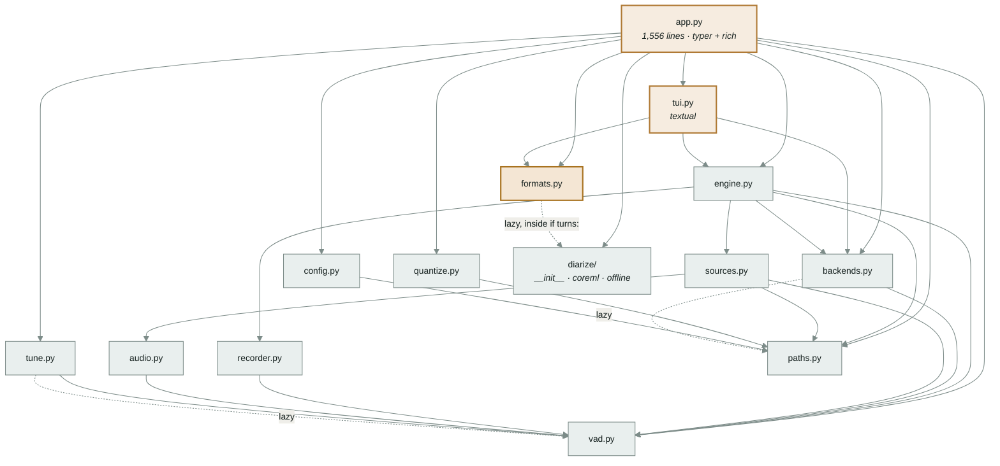
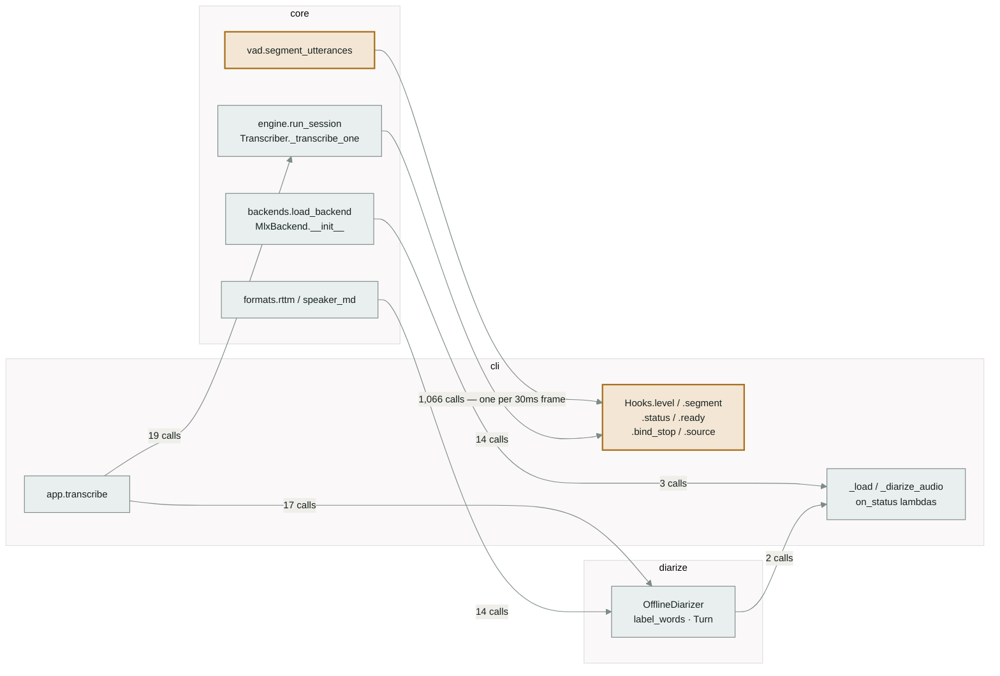

# What calls what at `118ae70`, and what uv workspaces actually do

This document describes the codebase **as it exists at `118ae70`**. It proposes nothing;
decisions and the migration sequence live in
[`docs/plans/2026-08-21-uv-workspace.md`](../plans/2026-08-21-uv-workspace.md).

Three kinds of evidence, and the difference between them is load-bearing:

- **Read from the tree** — §1.1, §1.2, §1.4–§1.8. Every line reference is to a file at
  `118ae70` and will drift.
- **Measured** — §1.3. A static call graph over the AST that counts what it cannot
  resolve, and a runtime profile of one real `m transcribe --speakers`. Both extractors
  are committed at [`tools/`](../../tools/), so every number below is re-runnable.
- **Executed** — §2. Six throwaway uv workspaces, built, synced and run. Nothing in §2 is
  quoted from documentation; the docs are cited only where they agree or are silent.

**Read §1.3 first if you read only one section.** It is the only part that answers the
question the split turns on. §1.1 and §1.2 now carry the `formats → diarize` edge and the
lazy-import column, but only because §1.3 found them: a module-scope import graph shows
neither, and that is the point of having both.

> **Revision, 2026-08-21.** The first version of this document had no call graph at all,
> and built its import inventory with a grep anchored at column 0 — so every
> function-scope import was invisible to it. Both are fixed here, and the fix cost two
> conclusions: `formats.py` is not a leaf, and the heaviest boundary traffic runs from
> core *into* the CLI rather than out of it.

---

## 1. The codebase at `118ae70`

### 1.1 One distribution, seventeen modules, 5,512 lines

`pyproject.toml` declares a single package, `mouth`, built by hatchling
from `src/mouth`, with two optional-dependency groups (`mlx`, `diarize`)
and one console script, `m`, pointing at `mouth.app:main` — the distribution and
import namespace are `mouth`, the command is `m`.

| Module | Lines | Internal imports | Lazy internal | Third-party |
|---|---:|---|---|---|
| `paths.py` | 78 | — | — | — |
| `formats.py` | 190 | — | **`diarize`** | — |
| `vad.py` | 202 | — | — | `numpy` |
| `audio.py` | 52 | `vad` | — | `numpy`, `soundfile`* |
| `recorder.py` | 120 | `vad` | — | `numpy`, `soundfile`* |
| `config.py` | 240 | `paths` | — | — |
| `quantize.py` | 114 | `paths` | — | `mlx`*, `mlx_qwen3_asr`* |
| `tune.py` | 416 | `vad` | `vad` | `numpy` |
| `sources.py` | 194 | `paths`, `audio`, `vad` | — | `numpy`, `sounddevice`* |
| `backends.py` | 924 | `vad` | `paths` | `numpy`, `torch`*, `qwen_asr`*, `mlx`* |
| `engine.py` | 403 | `paths`, `backends`, `recorder`, `sources`, `vad` | — | — |
| `tui.py` | 372 | `backends`, `engine`, `formats` | — | `rich`, `textual` |
| `app.py` | 1,556 | all of the above, plus `diarize` | `audio`, `diarize`, `diarize.coreml`, `diarize.offline`, `formats`, `sources`, `tui`, `tune` | `typer`, `rich` |
| `diarize/__init__.py` | 159 | — | — | `numpy` |
| `diarize/coreml.py` | 69 | — | — | `coremltools`* |
| `diarize/offline.py` | 420 | `diarize`, `diarize.coreml` | — | `numpy`, `scipy`* |

**The `Lazy internal` column is the one that matters, and the first version of this
document did not have it.** Internal imports were read with a grep anchored at column 0,
which sees module-scope imports and misses every indented one. There are 23 function-scope
internal imports in the tree. One of them — `formats.py:88` and `formats.py:164`,
`from .diarize import label_words` — crosses a boundary the rest of this document had
described as absent. See §1.3.

`*` imported inside a function, not at module scope. That laziness is deliberate and
documented: `PLC0415` is disabled in `[tool.ruff.lint]` with the reason that `m devices`
must not import torch, and dictation starting on a keypress depends on nothing heavy
being imported until something needs it.

### 1.2 The import graph



*Solid edges are module-scope imports; dashed are function-scope. Nothing imports
`app.py` or `tui.py`. The dashed `formats → diarize` edge is the one that matters:
`formats.py` looks like a leaf from its module-scope imports and is not one.*

### 1.3 The call graph, measured two ways

An import graph says which module names another. It does not say what calls what, and in
a codebase whose central extension point is a duck-typed `hooks` object, that is most of
the interesting traffic. Two passes, because neither alone is honest:

**Static** — an AST walk over all 17 modules, resolving calls against each module's own
bindings (module-scope imports, function-scope imports, local `def`s, `self.` against the
enclosing class and its in-package bases). A call it cannot resolve is counted, never
guessed.

```sh
uv run python tools/callgraph.py src/mouth
# 273 defs   233 resolved call edges   1,147 unresolved call sites
```

The 1,147 are stdlib, third-party, and — the important ones — duck-typed dispatch:
`.print` (74), `.append` (48), `.Option` (26), `.BadParameter` (18). A static pass cannot
see `hooks.segment(...)` or `backend.transcribe(...)` at all.

**Runtime** — `sys.setprofile` plus `threading.setprofile` (the engine's `Transcriber`
and the source both run on their own threads), over one real command:

```sh
uv run python tools/trace_calls.py -- \
    transcribe tests/fixtures/interview-excerpt.flac --speakers --out <tmp>
# mlx backend, qwen3-asr-1.7b-q8g64 · 2 speakers, 13 turns · 10 utterances,
# 106 words timed across 9 speaker blocks · all seven output files written
```

110 distinct call edges, of which **109 are invisible to the static pass**. A separate
trace over `pytest tests/ -q` produced 163 edges and does not reach the session loop,
because the suite's `hooks` implementations live in the tests rather than in `src/`.

#### The seam, as counted

Grouping modules by the split proposed in the plan (`core` / `diarize` / `cli`):

| Direction | Static edges | Runtime edges | Runtime calls | Share |
|---|---:|---:|---:|---:|
| **`core → cli`** (callbacks) | **0** | **8** | **1,083** | **95.4%** |
| `cli → core` | 50 | 11 | 19 | 1.7% |
| `cli → diarize` | 8 | 5 | 17 | 1.5% |
| `core → diarize` | 2 | 2 | 14 | 1.2% |
| `diarize → cli` (callback) | 0 | 1 | 2 | 0.2% |
| intra-package | 173 | 83 | — | — |

**96% of cross-boundary call volume runs from core back into the CLI.** Every one of
those edges is a callback the front end supplied — six `hooks` methods and two
`on_status` lambdas. None of them is an import; the import direction stays `cli → core`.



*Edge weights are calls in the traced run. The 1,066 is exactly one per 30ms frame over
the 32-second fixture, which is the arithmetic check that the trace is complete.*

#### Three things only the call graph shows

**`formats.py` calls into `diarize`, and the primary command path exercises it.**
`formats.speaker_md` imports `label_words` at function entry and called it once in the
traced run; `formats.rttm` reads `Turn.duration` 13 times. `write_outputs`'s own
`label_words` call site did **not** fire, because `_align_blocks` had already attached a
speaker to every word — which is what the comment at `formats.py:168` says it relies on.
So the coupling is: one live call, one near-dead fallback, and a duck-typed read of a
`diarize` type.

**The `hooks` protocol is the load-bearing interface and it is not declared anywhere.**
Six methods, described in a docstring at `engine.py:322-330`, implemented three times as
anonymous classes. It carries more cross-module call volume than every other edge in the
program combined. Nothing type-checks it.

**`app.main()` ends in `os._exit(code)`** (`app.py:1551`), documented as deliberate:
huggingface's `concurrent.futures` atexit hook joins non-daemon workers and hangs on
Ctrl-C during load. Any in-process caller of `main()` dies with it. (Found by the tracer,
whose `finally` block never ran.)

### 1.4 Four contracts currently defined inside `app.py`

`app.py` contains 155 lines that touch `typer.` or `console.`, and four helper
functions that are not CLI presentation:

**`_config(...)` — `app.py:197-267`.** Validates every session parameter and constructs
`engine.Config`. Five distinct checks (`language`, `backend`, `dtype`, `partials`,
`stream_chunk`, `min_speech` range), each raising `typer.BadParameter`. The `Cadence`
construction rule — `Cadence(first, growth, max_gap) if first > 0 else None`, i.e.
`--interim 0` means no partials at all — is stated here and nowhere else.

**`_load(cfg, ...)` — `app.py:268-297`.** Wraps `backends.load_backend` in a
`console.status` spinner and converts `BackendUnavailable` to `typer.BadParameter`. Its
docstring records that `on_status` *replaces* the spinner rather than adding to it,
because a caller whose stderr carries a machine-readable stream cannot also have a
spinner redrawing over it.

**`_align_blocks(backend, audio, segments, turns, language)` — `app.py:1064-1094`.**
Implements the word-timing contract added in `9d8fbf5` ("Time words by aligning each
speaker block, not each utterance"): slice the audio per speaker block, call
`backend.align()` on each, offset the returned word times onto the session clock, and
attach the speaker. Skips blocks shorter than `SAMPLE_RATE // 10`. Catches a per-block
exception so one bad block does not lose the transcript. Progress and the per-block
failure notice go through `console.status` / `console.print`.

**`_diarize_audio(audio, num_speakers)` — `app.py:1095-1127`.** Builds `OfflineConfig`
and `OfflineDiarizer`, runs it, and prints the per-speaker hold times. Raises
`typer.BadParameter` on `DiarizationUnavailable` and on `ValueError`, and on a live
source (`--speakers` needs a file).

Each of these four is reachable only by importing `mouth.app`, which
imports `typer` and `rich` at module scope.

### 1.5 The `hooks` protocol — the existing extension point

This is the interface §1.3 measured at 1,083 of 1,135 cross-package calls. What follows
is what it is, not what it costs.

`engine.run_session(cfg, hooks, backend=None, stop=None, source=None)`
(`engine.py:319-403`) is the session driver. Its docstring states the duck-typed
contract in full:

> hooks needs: `status(str)`, `ready(threshold)`, `bind_stop(Event)`,
> `level(rms, in_speech)`, `segment(Segment)`, `error(offset, msg)`; optionally
> `interim(Segment)` and `attach(worker)`, and optionally `source(source)` to see the
> opened source before frames are pulled.

There are three implementations, each an anonymous class defined inside a typer command:
`cli` (`app.py:1258-1305`), `dictate` (inside `app.py:1356+`), and the Textual app in
`tui.build_tui`. `run_session` is blocking and run-to-completion: it returns
`(segments, words, recorder)` only after the source is exhausted or `stop` is set.

Two things are already mutable while a session runs:

- **`Backend.context`** — the `Biasable` protocol (`backends.py:145-160`). Its docstring
  says it is an attribute rather than a `transcribe()` argument "because that is what
  lets a front end change it while the session runs, which is the whole point of editing
  it in the TUI." `tui.py:259` does exactly that: `backend.context = event.value.strip()`.
- **`stop`** — a `threading.Event` handed to the caller through `hooks.bind_stop`.

Everything else in `engine.Config` is read once, at or before `run_session` entry:
`threshold` before calibration, `cadence`/`min_speech`/`cuts` when
`segment_utterances` is called, `partials`/`stream_chunk_sec` when `open_partials`
runs, `language`/`timestamps` when the `Transcriber` is constructed.

### 1.6 The existing machine-readable surface

`m dictate --events` (`app.py:1337-1353`) writes JSON lines to **stderr** while stdout
carries the transcript and nothing else. The class docstring calls the split "the whole
interface". Event names emitted: `loading`, plus the states around wait/speech/final
(`app.py:1442,1466,1499,1510,1521`). README §"Events, for anything that wants to draw"
documents it.

This is the only existing programmatic protocol in the repo. It is one-way (out only),
per-process, and tied to a single utterance's lifetime.

### 1.7 What the tests import

`tests/test_core.py` imports `mouth.{config, backends, formats, recorder,
vad, paths, tune}`. `tests/test_diarize.py` imports `mouth.{diarize,
diarize.offline, formats}`. Neither imports `app` or `tui` at module scope;
`test_core.py:376` builds the TUI transcript widget and `test_core.py:405` drives a
Ctrl-C-during-load path, both via in-function imports.

Nothing reads `mouth.__version__`; it is defined at
`src/mouth/__init__.py:3` and referenced nowhere else in `src/` or
`tests/`.

### 1.8 Tooling configuration bound to the current layout

- `[tool.ruff] src = ["src", "tests"]`
- `[tool.ruff.lint.per-file-ignores]` keys four literal paths:
  `src/mouth/{app,engine,sources,tui}.py`
- `[tool.ty.src] include = ["src", "tests"]`
- `[tool.ty.environment] root = ["./src"]`
- `[tool.hatch.build.targets.wheel] packages = ["src/mouth"]`

README documents the install as `uv tool install -e ".[mlx,diarize]"` and warns that a
non-editable install needs `--refresh-package mouth`, because uv caches the
built wheel for a local path.

---

## 2. uv workspaces, as executed

Five tests, run against **uv 0.9.16 (Homebrew 2025-12-06)** on CPython 3.12.12, darwin.
Each was a scratch workspace built from nothing. These are learning tests: they test my
understanding of uv, not this codebase.

### 2.1 A workspace root can be virtual

```toml
[project]
name = "mouth-workspace"
version = "0"
requires-python = ">=3.12"
dependencies = ["lt-cli", "lt-diarize"]

[tool.uv]
package = false

[tool.uv.workspace]
members = ["packages/*"]

[tool.uv.sources]
lt-cli = { workspace = true }
lt-diarize = { workspace = true }
```

`uv sync` at that root creates `.venv`, builds every member, and installs them. The root
itself is not built and does not need a `[build-system]`. Confirmed: a root with
`package = false` may still carry `[project.dependencies]`, and they are honoured.

### 2.2 One import namespace can span several distributions

Three members, each shipping into `src/mouth/`, **with no
`__init__.py` at the `mouth/` level in any of them** (PEP 420 implicit
namespace):

```
packages/lt-core/src/mouth/engine.py
packages/lt-diarize/src/mouth/diarize/__init__.py
packages/lt-cli/src/mouth/app.py
```

`from mouth.engine import ENGINE` and `from mouth.diarize
import TURN` both resolve from `app.py` after `uv sync`. Each member declares
`packages = ["src/mouth"]` in `[tool.hatch.build.targets.wheel]` and
hatchling builds all three without complaint.

A sub-package keeping its own `__init__.py` is fine — `diarize/__init__.py` has 159
lines of real content and still works. Only the shared top level must have none.

### 2.3 Members are installed editable, including through `uv tool install`

`uv sync` produced `_editable_impl_lt_core.pth`, `_editable_impl_lt_diarize.pth` and
`_editable_impl_lt_cli.pth` in the workspace venv. Editing `lt-core`'s source and
re-running the entry point showed the new value with no reinstall.

The same holds for a tool install of a **member** directory:

```sh
uv tool install -e './packages/lt-cli[extra]' --force
```

installs `lt-cli` **and its workspace siblings** editable — `_editable_impl_lt_core.pth`
appears in the tool environment, and an edit to core's source changed the installed
`m`'s output on the next run. uv discovers the workspace by walking up from the member
directory; no flag is needed.

### 2.4 A partial install is genuinely partial

A fresh venv with only `lt-core` installed:

```
import mouth.engine      -> OK
import mouth.app         -> ModuleNotFoundError: No module named 'mouth.app'
import mouth.diarize     -> ModuleNotFoundError: No module named 'mouth.diarize'
```

The namespace does not paper over a missing member. This is what makes an "a package
must not import X" rule testable rather than a convention.

### 2.5 A virtual root can forward extras to a member

```toml
[project.optional-dependencies]
mlx = ["lt-core[mlx]"]
```

`uv sync` installed 0 of the mlx-extra dependencies; `uv sync --extra mlx` installed
them. `[dependency-groups] dev` on the root resolved normally and `uv run pytest` found
pytest.

### 2.6 What the documentation adds, and where it is silent

From <https://docs.astral.sh/uv/concepts/projects/workspaces/>:

- `uv lock` operates on the whole workspace and produces **one** lockfile.
- All members share a single `requires-python` — the intersection of their values.
- Workspace-root `[tool.uv.sources]` apply to all members unless a member overrides
  them, and a member's override wins completely, "even if markers don't match the
  current platform".
- Workspaces are the wrong tool when members have **conflicting** requirements or need
  separate virtual environments; path dependencies are the alternative, at the cost of
  `uv run --package`.
- Stated limit: "Python does not provide dependency isolation", so uv cannot prevent a
  package importing an undeclared workspace member. §2.4 shows what *can* be enforced —
  an install that omits the member — and that is a test, not a guarantee at author time.

The workspaces page does not mention virtual roots or `package = false`; §2.1 and §2.5
are results, not quotations.

---

## Limits of this document

- **§1.1, §1.2 and §1.4–§1.8 are a read, not a run.** Line numbers are from `118ae70`
  and will drift.
- **§1.3's runtime trace is one command on one machine.** `m transcribe … --speakers`,
  mlx backend, `qwen3-asr-1.7b-q8g64`, a 32-second fixture. `m tui`, `m cli`,
  `m dictate`, `m tune` and `m quantize` were **not** traced, so their hook call
  volumes are inferred from `run_session` being shared, not measured. A torch-backend run
  would show different `backends` internals.
- **§1.3's static pass under-reports.** 1,147 call sites went unresolved. It resolves
  names, module aliases, in-package classes and `self.` against in-package bases; it does
  not resolve calls through a variable, which is exactly how `hooks`, `backend`, `source`
  and `partials` are reached. Treat the static edge counts as a floor.
- **The tracer perturbs what it measures.** Under `sys.setprofile` the suite went from 27s
  to 287s and `test_tui_transcript_widget_tree_is_bounded` timed out; it passes clean
  (134 passed, 1 skipped, 27.5s). No call-graph claim rests on that test.
- **§2 is one machine, one uv version.** uv 0.9.16, Homebrew, darwin 25.5.0, CPython
  3.12.12. The scratch packages had trivial dependencies; nothing in §2 exercised
  torch, mlx or coremltools resolution, and a real resolution across those three extras
  in one lockfile has not been attempted.
- **`uv tool install` was tested with a stand-in extra** (`idna`), not with `mlx` or
  `diarize`. The mechanism is the same; the resolution cost is not.
- **The lazy-import inventory in §1.1 is from a grep for `import` inside function
  bodies.** A dynamic import by string, if one exists, would not appear.
- **No claim here is about which split is right.** §1 says what is coupled to what;
  it does not say what should be.
