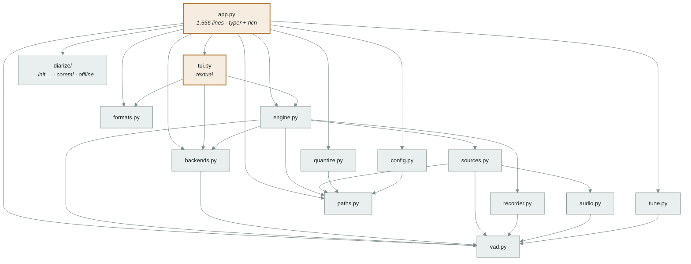

# Module boundaries, and what uv workspaces actually do

This document describes the codebase **as it exists at `118ae70`** and records the
result of five executed tests against `uv 0.9.16`. It proposes nothing. Decisions and
the migration sequence live in
[`docs/plans/2026-08-21-uv-workspace.md`](../plans/2026-08-21-uv-workspace.md).

Two sections, and they were produced by different methods:

- **§1 Codebase** — read from the tree. Every line reference is to a file at `118ae70`.
- **§2 uv** — executed. Each finding is a throwaway workspace built, synced and run.
  Nothing in §2 is quoted from documentation; the documentation is cited only where it
  agrees or is silent.

---

## 1. The codebase at `118ae70`

### 1.1 One distribution, seventeen modules, 5,512 lines

`pyproject.toml` declares a single package, `localtranscription`, built by hatchling
from `src/localtranscription`, with two optional-dependency groups (`mlx`, `diarize`)
and two console scripts (`localtranscription`, `lt`) both pointing at
`localtranscription.app:main`.

| Module | Lines | Internal imports | Third-party |
|---|---:|---|---|
| `paths.py` | 78 | — | — |
| `formats.py` | 190 | — | — |
| `vad.py` | 202 | — | `numpy` |
| `audio.py` | 52 | `vad` | `numpy`, `soundfile`* |
| `recorder.py` | 120 | `vad` | `numpy`, `soundfile`* |
| `config.py` | 240 | `paths` | — |
| `quantize.py` | 114 | `paths` | `mlx`*, `mlx_qwen3_asr`* |
| `tune.py` | 416 | `vad` | `numpy` |
| `sources.py` | 194 | `paths`, `audio`, `vad` | `numpy`, `sounddevice`* |
| `backends.py` | 924 | `vad` | `numpy`, `torch`*, `qwen_asr`*, `mlx`* |
| `engine.py` | 403 | `paths`, `backends`, `recorder`, `sources`, `vad` | — |
| `tui.py` | 372 | `backends`, `engine`, `formats` | `rich`, `textual` |
| `app.py` | 1,556 | all of the above, plus `diarize` | `typer`, `rich` |
| `diarize/__init__.py` | 159 | — | `numpy` |
| `diarize/coreml.py` | 69 | — | `coremltools`* |
| `diarize/offline.py` | 420 | `diarize`, `diarize.coreml` | `numpy`, `scipy`* |

`*` imported inside a function, not at module scope. That laziness is deliberate and
documented: `PLC0415` is disabled in `[tool.ruff.lint]` with the reason that `lt devices`
must not import torch, and dictation starting on a keypress depends on nothing heavy
being imported until something needs it.

### 1.2 The import graph



*Nothing imports `app.py` or `tui.py`. Everything else is imported by at least two
callers. `diarize/` has no internal dependency on any other module.*

### 1.3 Four contracts currently defined inside `app.py`

`app.py` contains 155 lines that touch `typer.` or `console.`, and four helper
functions that are not CLI presentation:

**`_config(...)` — `app.py:197-267`.** Validates every session parameter and constructs
`engine.Config`. Five distinct checks (`language`, `backend`, `dtype`, `partials`,
`stream_chunk`, `min_speech` range), each raising `typer.BadParameter`. The `Cadence`
construction rule — `Cadence(first, growth, max_gap) if first > 0 else None`, i.e.
`--interim 0` means no partials at all — is stated here and nowhere else.

**`_load(cfg, ...)` — `app.py:268-297`.** Wraps `backends.load_backend` in a
`console.status` spinner and converts `BackendUnavailable` to `typer.BadParameter`. Its
docstring records that `on_status` *replaces* the spinner rather than adding to it,
because a caller whose stderr carries a machine-readable stream cannot also have a
spinner redrawing over it.

**`_align_blocks(backend, audio, segments, turns, language)` — `app.py:1064-1094`.**
Implements the word-timing contract added in `9d8fbf5` ("Time words by aligning each
speaker block, not each utterance"): slice the audio per speaker block, call
`backend.align()` on each, offset the returned word times onto the session clock, and
attach the speaker. Skips blocks shorter than `SAMPLE_RATE // 10`. Catches a per-block
exception so one bad block does not lose the transcript. Progress and the per-block
failure notice go through `console.status` / `console.print`.

**`_diarize_audio(audio, num_speakers)` — `app.py:1095-1127`.** Builds `OfflineConfig`
and `OfflineDiarizer`, runs it, and prints the per-speaker hold times. Raises
`typer.BadParameter` on `DiarizationUnavailable` and on `ValueError`, and on a live
source (`--speakers` needs a file).

Each of these four is reachable only by importing `localtranscription.app`, which
imports `typer` and `rich` at module scope.

### 1.4 The `hooks` protocol — the existing extension point

`engine.run_session(cfg, hooks, backend=None, stop=None, source=None)`
(`engine.py:319-403`) is the session driver. Its docstring states the duck-typed
contract in full:

> hooks needs: `status(str)`, `ready(threshold)`, `bind_stop(Event)`,
> `level(rms, in_speech)`, `segment(Segment)`, `error(offset, msg)`; optionally
> `interim(Segment)` and `attach(worker)`, and optionally `source(source)` to see the
> opened source before frames are pulled.

There are three implementations, each an anonymous class defined inside a typer command:
`cli` (`app.py:1258-1305`), `dictate` (inside `app.py:1356+`), and the Textual app in
`tui.build_tui`. `run_session` is blocking and run-to-completion: it returns
`(segments, words, recorder)` only after the source is exhausted or `stop` is set.

Two things are already mutable while a session runs:

- **`Backend.context`** — the `Biasable` protocol (`backends.py:145-160`). Its docstring
  says it is an attribute rather than a `transcribe()` argument "because that is what
  lets a front end change it while the session runs, which is the whole point of editing
  it in the TUI." `tui.py:259` does exactly that: `backend.context = event.value.strip()`.
- **`stop`** — a `threading.Event` handed to the caller through `hooks.bind_stop`.

Everything else in `engine.Config` is read once, at or before `run_session` entry:
`threshold` before calibration, `cadence`/`min_speech`/`cuts` when
`segment_utterances` is called, `partials`/`stream_chunk_sec` when `open_partials`
runs, `language`/`timestamps` when the `Transcriber` is constructed.

### 1.5 The existing machine-readable surface

`lt dictate --events` (`app.py:1337-1353`) writes JSON lines to **stderr** while stdout
carries the transcript and nothing else. The class docstring calls the split "the whole
interface". Event names emitted: `loading`, plus the states around wait/speech/final
(`app.py:1442,1466,1499,1510,1521`). README §"Events, for anything that wants to draw"
documents it.

This is the only existing programmatic protocol in the repo. It is one-way (out only),
per-process, and tied to a single utterance's lifetime.

### 1.6 What the tests import

`tests/test_core.py` imports `localtranscription.{config, backends, formats, recorder,
vad, paths, tune}`. `tests/test_diarize.py` imports `localtranscription.{diarize,
diarize.offline, formats}`. Neither imports `app` or `tui` at module scope;
`test_core.py:376` builds the TUI transcript widget and `test_core.py:405` drives a
Ctrl-C-during-load path, both via in-function imports.

Nothing reads `localtranscription.__version__`; it is defined at
`src/localtranscription/__init__.py:3` and referenced nowhere else in `src/` or
`tests/`.

### 1.7 Tooling configuration bound to the current layout

- `[tool.ruff] src = ["src", "tests"]`
- `[tool.ruff.lint.per-file-ignores]` keys four literal paths:
  `src/localtranscription/{app,engine,sources,tui}.py`
- `[tool.ty.src] include = ["src", "tests"]`
- `[tool.ty.environment] root = ["./src"]`
- `[tool.hatch.build.targets.wheel] packages = ["src/localtranscription"]`

README documents the install as `uv tool install -e ".[mlx,diarize]"` and warns that a
non-editable install needs `--refresh-package localtranscription`, because uv caches the
built wheel for a local path.

---

## 2. uv workspaces, as executed

Five tests, run against **uv 0.9.16 (Homebrew 2025-12-06)** on CPython 3.12.12, darwin.
Each was a scratch workspace built from nothing. These are learning tests: they test my
understanding of uv, not this codebase.

### 2.1 A workspace root can be virtual

```toml
[project]
name = "localtranscription-workspace"
version = "0"
requires-python = ">=3.12"
dependencies = ["lt-cli", "lt-diarize"]

[tool.uv]
package = false

[tool.uv.workspace]
members = ["packages/*"]

[tool.uv.sources]
lt-cli = { workspace = true }
lt-diarize = { workspace = true }
```

`uv sync` at that root creates `.venv`, builds every member, and installs them. The root
itself is not built and does not need a `[build-system]`. Confirmed: a root with
`package = false` may still carry `[project.dependencies]`, and they are honoured.

### 2.2 One import namespace can span several distributions

Three members, each shipping into `src/localtranscription/`, **with no
`__init__.py` at the `localtranscription/` level in any of them** (PEP 420 implicit
namespace):

```
packages/lt-core/src/localtranscription/engine.py
packages/lt-diarize/src/localtranscription/diarize/__init__.py
packages/lt-cli/src/localtranscription/app.py
```

`from localtranscription.engine import ENGINE` and `from localtranscription.diarize
import TURN` both resolve from `app.py` after `uv sync`. Each member declares
`packages = ["src/localtranscription"]` in `[tool.hatch.build.targets.wheel]` and
hatchling builds all three without complaint.

A sub-package keeping its own `__init__.py` is fine — `diarize/__init__.py` has 159
lines of real content and still works. Only the shared top level must have none.

### 2.3 Members are installed editable, including through `uv tool install`

`uv sync` produced `_editable_impl_lt_core.pth`, `_editable_impl_lt_diarize.pth` and
`_editable_impl_lt_cli.pth` in the workspace venv. Editing `lt-core`'s source and
re-running the entry point showed the new value with no reinstall.

The same holds for a tool install of a **member** directory:

```sh
uv tool install -e './packages/lt-cli[extra]' --force
```

installs `lt-cli` **and its workspace siblings** editable — `_editable_impl_lt_core.pth`
appears in the tool environment, and an edit to core's source changed the installed
`lt`'s output on the next run. uv discovers the workspace by walking up from the member
directory; no flag is needed.

### 2.4 A partial install is genuinely partial

A fresh venv with only `lt-core` installed:

```
import localtranscription.engine      -> OK
import localtranscription.app         -> ModuleNotFoundError: No module named 'localtranscription.app'
import localtranscription.diarize     -> ModuleNotFoundError: No module named 'localtranscription.diarize'
```

The namespace does not paper over a missing member. This is what makes an "a package
must not import X" rule testable rather than a convention.

### 2.5 A virtual root can forward extras to a member

```toml
[project.optional-dependencies]
mlx = ["lt-core[mlx]"]
```

`uv sync` installed 0 of the mlx-extra dependencies; `uv sync --extra mlx` installed
them. `[dependency-groups] dev` on the root resolved normally and `uv run pytest` found
pytest.

### 2.6 What the documentation adds, and where it is silent

From <https://docs.astral.sh/uv/concepts/projects/workspaces/>:

- `uv lock` operates on the whole workspace and produces **one** lockfile.
- All members share a single `requires-python` — the intersection of their values.
- Workspace-root `[tool.uv.sources]` apply to all members unless a member overrides
  them, and a member's override wins completely, "even if markers don't match the
  current platform".
- Workspaces are the wrong tool when members have **conflicting** requirements or need
  separate virtual environments; path dependencies are the alternative, at the cost of
  `uv run --package`.
- Stated limit: "Python does not provide dependency isolation", so uv cannot prevent a
  package importing an undeclared workspace member. §2.4 shows what *can* be enforced —
  an install that omits the member — and that is a test, not a guarantee at author time.

The workspaces page does not mention virtual roots or `package = false`; §2.1 and §2.5
are results, not quotations.

---

## Limits of this document

- **§1 is a read, not a run.** No behaviour was executed against this codebase. Line
  numbers are from `118ae70` and will drift.
- **§2 is one machine, one uv version.** uv 0.9.16, Homebrew, darwin 25.5.0, CPython
  3.12.12. The scratch packages had trivial dependencies; nothing in §2 exercised
  torch, mlx or coremltools resolution, and a real resolution across those three extras
  in one lockfile has not been attempted.
- **`uv tool install` was tested with a stand-in extra** (`idna`), not with `mlx` or
  `diarize`. The mechanism is the same; the resolution cost is not.
- **The lazy-import inventory in §1.1 is from a grep for `import` inside function
  bodies.** A dynamic import by string, if one exists, would not appear.
- **No claim here is about which split is right.** §1 says what is coupled to what;
  it does not say what should be.
